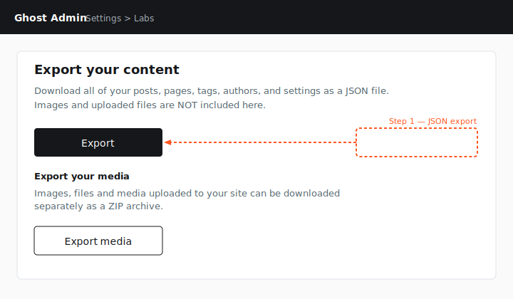
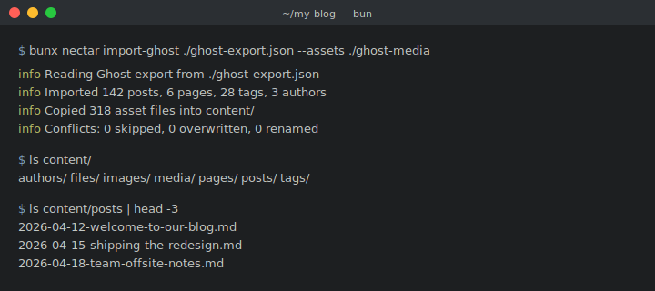
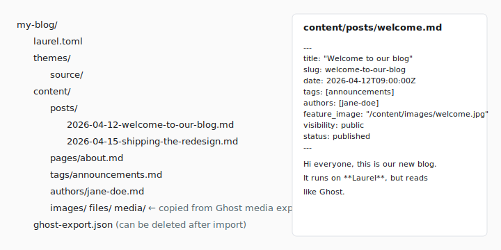
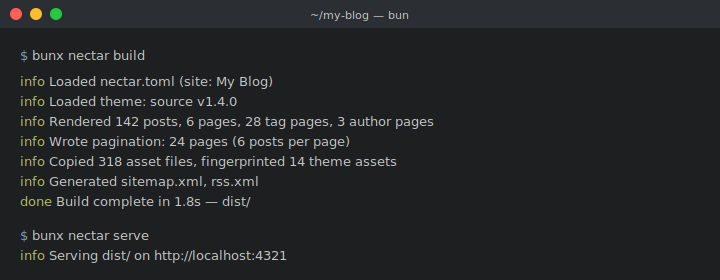

# Migrating from Ghost to Nectar

This is the long-form guide for moving a real blog off Ghost and onto Nectar.
It assumes you already run Ghost (self-hosted or Ghost(Pro)) and want to keep
your posts, pages, tags, authors, images, and theme exactly as they are — but
publish as static files instead of running a Node server and a database.

If you only need a 30-second summary, the example blog ships a short post that
shows the same flow at a higher level: `example/content/posts/migrating-from-ghost.md`.
This document is the version with all the edge cases, screenshots, and
deployment notes.

> **About the screenshots.** The illustrations in this guide live in
> `docs/migration-from-ghost/` as SVGs (referenced from this page as
> `../migration-from-ghost/`). They are schematic — they show the
> shape of each Ghost or Nectar screen and which control you are about to
> click. Your Ghost admin will look slightly different depending on your Ghost
> version and any custom branding, but the labels and locations are stable.

---

## Before you begin: if you have paying members

If your Ghost site sells paid subscriptions, runs a members-only newsletter, or
gates content with `visibility: paid` / `visibility: members`, **stop and read
[`docs/MEMBERS.md`](../MEMBERS.md) before you migrate anything**. Nectar is a
static site generator with no server runtime, no user database, and no payment
integration. That changes what Ghost's Members feature can and cannot do after
the move.

**What you keep:**

- Every post and page, including those marked `visibility: members` or `paid`.
  The Markdown frontmatter preserves the `visibility` field.
- The theme's members UI shell (sign-in button, subscribe CTAs, paywall stubs)
  — provided you wire an external provider via `[components.portal]`.
- Your member list as a CSV, which you import into a third-party newsletter or
  subscription service of your choosing.

**What you lose, with no in-process replacement:**

- **The Ghost Members database itself.** Nectar does not store emails,
  password hashes, or tier flags. You export the list from Ghost and hand it
  to your replacement provider (Buttondown, Beehiiv, Substack, or a
  self-hosted Members API). See [`docs/MEMBERS.md` § 1](../MEMBERS.md#1-migration-paths-off-ghost-members).
- **Server-side paywalls.** A post with `visibility: paid` is truncated to a
  stub for *every* visitor at build time. The static page cannot check
  "did this person pay" — that is a server query Nectar does not perform.
  Wiring a JS-side reveal after auth is your provider's job, not Nectar's.
- **`{{#access}}` content gating.** The `{{access}}` helper always returns
  `false` in a static build. Theme blocks wrapped in `{{#access}}...{{/access}}`
  render only the `{{else}}` branch. See
  [`docs/MEMBERS.md` § 2](../MEMBERS.md#2-what-the-nectar-members-surface-actually-exposes).
- **Per-viewer personalisation.** `@member.name`, `@member.email`,
  `@member.paid` are empty strings for every visitor. "Welcome back,
  {{@member.name}}" cannot work without a client-side script from your
  provider.
- **Sign-in, account, billing, and upgrade pages.** The Ghost Portal hash
  routes (`#/portal/signin`, `#/portal/account`, `#/portal/upgrade`) are
  inert in the static build. Account management — billing, tier changes,
  comps, invoices — lives on the provider's hosted page after the move, not
  on your Nectar site.
- **Newsletter email sending.** Ghost's per-post email send pipeline does not
  exist in Nectar. Schedule sends from your provider's dashboard instead.
- **Comments tied to membership.** `{{comments}}` is an empty hook. Wire
  Giscus / Disqus / Utterances client-side — none of them check Ghost member
  identity.

If any of the above is a hard requirement for your site, the honest answer is
that Nectar is the wrong tool, and you should keep running Ghost (or a
Ghost-compatible backend) for the dynamic surface and use Nectar only for the
public reading surface. [`docs/MEMBERS.md` § 5](../MEMBERS.md#5-known-parity-gaps)
spells out the parity gaps in full.

---

## What you will end up with

```
my-blog/
├── nectar.toml                 # site config (replaces Ghost's admin settings)
├── content/                    # your posts/pages/tags/authors/images
│   ├── posts/*.md
│   ├── pages/*.md
│   ├── tags/*.md
│   ├── authors/*.md
│   └── images/  files/  media/
├── themes/source/              # your Ghost theme (any .hbs theme works)
└── dist/                       # output: pure HTML/CSS/JS, deploy anywhere
```

No server. No database. `nectar build` regenerates the whole site from the
files in `content/` and your theme. You version everything in Git.

---

## Step 0 — Prerequisites

You will need:

- **[Bun](https://bun.sh) >= 1.3** on your local machine. (`bun --version`).
  Nectar's CLI is invoked through `bunx nectar` or `bun run`.
- **Admin access** to your Ghost site (you need the Settings → Labs page to
  export content).
- **Your Ghost theme**, either as the official Ghost Source theme (vendored in
  the Nectar repo at `example/themes/source/`) or a `.zip` you downloaded from
  Ghost's *Settings → Design → Change theme → Advanced → Download*. Any theme
  that uses standard Ghost helpers will render — see
  [`docs/GHOST_COMPATIBILITY.md`](../GHOST_COMPATIBILITY.md) for the helper
  coverage matrix.
- **A new empty directory** for the Nectar project. Don't try to migrate
  in-place over a running Ghost install.

If you do not yet have a Nectar project skeleton, scaffold one:

```bash
mkdir my-blog && cd my-blog
bunx nectar init --yes
```

This drops a `nectar.toml`, a starter `themes/source/` link, and a `content/`
tree. You will overwrite most of it during the import, but the layout matters
because `nectar import-ghost` writes into `content/`.

---

## Step 1 — Export your content from Ghost

Open your Ghost admin and navigate to **Settings → Labs**. Scroll to the
**Export your content** section.



Click **Export**. Ghost downloads a single JSON file, typically named
`your-site.ghost.YYYY-MM-DD.json`. This file contains every post (published,
draft, scheduled), every page, every tag, every author profile, plus your
Ghost-side settings.

**It does not contain images or uploaded files.** Those need a separate step.

Right below the JSON export, Ghost has a second control — **Export your
media** — which produces a ZIP archive of `/content/images/`, `/content/files/`,
and `/content/media/`. Click it and save the ZIP somewhere temporary.

> **If you are self-hosting Ghost** and have shell access, you can skip the
> Export your media button and just `rsync` or `scp` the Ghost
> `content/images/`, `content/files/`, and `content/media/` directories
> directly. That is faster for large sites and avoids the ZIP step.

When you finish this step, you should have on disk:

```
~/Downloads/
├── my-site.ghost.2026-05-19.json     # the JSON export
└── ghost-media-2026-05-19.zip        # the media archive
```

Unzip the media archive so you end up with a folder that contains
`images/`, `files/`, and/or `media/` subdirectories. Note the path — you
will pass it to `nectar import-ghost` in the next step.

---

## Step 2 — Run `nectar import-ghost`

From inside your new Nectar project directory:

```bash
bunx nectar import-ghost \
  ~/Downloads/my-site.ghost.2026-05-19.json \
  --assets ~/Downloads/ghost-media-2026-05-19/
```

The importer:

1. Reads the JSON export.
2. Converts each post's HTML body to Markdown via
   [turndown](https://github.com/mixmark-io/turndown), preserving Koenig card
   fences for `<!--kg-card-begin: markdown -->` / `html` / `email` / `email-cta`
   blocks so they round-trip cleanly.
3. Writes `content/posts/*.md`, `content/pages/*.md`, `content/tags/*.md`, and
   `content/authors/*.md`. Frontmatter is YAML; see the mapping table below.
4. Copies the `images/`, `files/`, and `media/` directories from `--assets`
   into `content/` so that the `/content/images/...` URLs Ghost wrote into your
   post bodies continue to resolve.



A typical run looks like the screenshot above:

```
info  Imported 142 posts, 6 pages, 28 tags, 3 authors
info  Copied 318 asset files into content/
info  Conflicts: 0 skipped, 0 overwritten, 0 renamed
```

### Conflict handling

If you re-run the import (for example, after taking a fresh export), pass
`--on-conflict` to decide what happens when a slug already exists:

| Flag                       | Behavior                                                        |
|----------------------------|-----------------------------------------------------------------|
| `--on-conflict skip`       | Default. Keep the existing file, skip the new one.              |
| `--on-conflict overwrite`  | Replace the existing file with the freshly imported one.        |
| `--on-conflict rename`     | Write the new file with a numeric suffix (`my-post-1.md`, etc). |

Use `overwrite` for the first re-import after you have edited Ghost to fix a
typo. Use `rename` if you have already started hand-editing the Markdown and
want to diff the new import against your edits before adopting any of them.

### What gets imported

| Ghost field            | Nectar frontmatter                       |
|------------------------|------------------------------------------|
| `title`                | `title`                                  |
| `slug`                 | `slug`                                   |
| `published_at`         | `date`                                   |
| `updated_at`           | `updated_at`                             |
| `featured`             | `featured`                               |
| `feature_image`        | `feature_image`                          |
| `feature_image_alt`    | `feature_image_alt`                      |
| `feature_image_caption`| `feature_image_caption`                  |
| `visibility`           | `visibility` (`public`/`members`/`paid`) |
| `status`               | `status` (`published`/`draft`)           |
| `custom_excerpt`       | `custom_excerpt`                         |
| `tags`                 | `tags: [slug, ...]`                      |
| `authors`              | `authors: [slug, ...]`                   |
| `meta_title`           | `meta_title`                             |
| `meta_description`     | `meta_description`                       |
| `og_title` / `og_image`/ `og_description`     | `og_title` / `og_image` / `og_description` |
| `twitter_title` / `twitter_image` / `twitter_description` | `twitter_title` / `twitter_image` / `twitter_description` |
| `canonical_url`        | `canonical_url`                          |
| `codeinjection_head`   | `codeinjection_head`                     |
| `codeinjection_foot`   | `codeinjection_foot`                     |

Tags and authors get their own Markdown files if they carry a description,
feature image, or meta fields. Otherwise they are referenced from posts by
slug and do not need a standalone file.

### Ghost URL placeholders

Ghost replaces your site URL with the literal token `__GHOST_URL__` inside
exported HTML and asset fields. The importer strips that token so the
remaining `/content/images/...` paths resolve against the deployed site root.
You should never see `__GHOST_URL__` in your imported Markdown. If you do,
report it — it means the placeholder slipped past a field the importer is not
yet rewriting.

### What does NOT get imported

These are explicitly out of scope and the importer drops them silently:

- **Members, subscribers, paid plans.** Nectar is static; there is no
  members database.
- **Newsletter-only / email-only posts.** Email rendering is a Ghost
  server feature; static sites have no equivalent. Posts with
  `email_only: true` are still imported as Markdown, but they will render as
  regular pages with no email send pipeline.
- **The Ghost Content API.** Themes that call `{{#get}}` against a remote
  endpoint resolve against the local content graph instead — see the Ghost
  compatibility doc.
- **Drafts in Mobiledoc/Lexical-only form.** If a post has only a
  `mobiledoc` or `lexical` body and no rendered `html`, the importer logs a
  warning and skips the body. Publish or re-save the post in Ghost first so
  it produces HTML, then re-export.

---

## Step 3 — Verify the imported content tree

After import, your project should look like the diagram below.



A few sanity checks before you build:

```bash
# Count what came in
ls content/posts | wc -l
ls content/pages | wc -l

# Sample one post and check the frontmatter
cat content/posts/$(ls content/posts | head -1)

# Make sure feature images landed
ls content/images | head
```

Open a couple of `.md` files in your editor and skim them. Ghost exports often
have HTML quirks (extra `<br>` tags, encoded entities, empty `<p>` blocks).
turndown handles the common cases cleanly, but if a single post had
hand-edited HTML, this is your chance to fix it.

---

## Step 4 — Edit `nectar.toml`

Nectar's config file replaces almost everything you used to configure in the
Ghost admin: site title, description, URL, logo, theme customization,
navigation menus, and which optional components (RSS, sitemap, OpenGraph) are
enabled.

`nectar init` already wrote a `nectar.toml` skeleton. Open it and fill in
your real values. The shape mirrors the example project's
[`example/nectar.toml`](../../example/nectar.toml); the most important sections
to update for migration are:

```toml
[site]
title = "My Blog"                          # ← your Ghost "Site title"
description = "Field notes from the team." # ← your Ghost "Site description"
url = "https://blog.example.com"           # ← your final deployed URL
locale = "en"                              # ← your Ghost "Publication language"
timezone = "Asia/Tokyo"                    # ← your Ghost "Publication timezone"
accent_color = "#FF5722"                   # ← your Ghost accent color
logo = "/content/images/logo.png"          # ← copy/rename from Ghost as needed
icon = "/content/images/icon.png"

[theme]
name = "source"                            # ← directory name under themes/
dir = "themes"

[theme.custom]
# Mirror whatever knobs your Ghost theme exposes in its package.json
# `config.custom` block. Source theme example:
navigation_layout = "Logo on the left"
post_feed_style = "List"
show_author = true
show_publish_date = true

[content]
posts_dir = "content/posts"
pages_dir = "content/pages"
authors_dir = "content/authors"
tags_dir = "content/tags"
assets_dir = "content/images"

[build]
output_dir = "dist"
base_path = "/"             # set to "/blog/" if hosting at a subpath
posts_per_page = 6

[[navigation]]
label = "Home"
url = "/"

[[navigation]]
label = "About"
url = "/about/"

[components.rss]
enabled = true
items = 10

[components.sitemap]
enabled = true

[components.opengraph]
enabled = true
```

> **`@custom` values.** Ghost themes ship a `package.json` declaring their
> `config.custom` settings — those are the knobs you used to toggle in the
> Ghost admin's *Design → Customize* panel. In Nectar they live under
> `[theme.custom]` in `nectar.toml`. Read your theme's `package.json` to see
> which keys it expects. The Source theme example in
> `example/nectar.toml` covers every Source-supported key.

If your theme uses translations (Source ships a `locales/` directory), set
`[site].locale` to match (`en`, `de`, etc.) and Nectar's `{{t}}` helper will
pick the right strings.

### Navigation

Ghost stores primary/secondary navigation in its database. Nectar reads it
from `nectar.toml`:

```toml
[[navigation]]
label = "Home"
url = "/"

[[navigation]]
label = "About"
url = "/about/"

[[secondary_navigation]]
label = "RSS"
url = "/rss.xml"
```

Copy the entries you had in *Settings → Navigation* into these blocks.
Relative URLs (e.g. `/about/`) are resolved against `[site].url` at build
time. If you set `[build].base_path` to a subpath, the helpers prefix it
automatically — you do not need to bake it in here.

---

## Step 5 — Drop in your theme

Two options:

**Option A — use the vendored Source theme.** Symlink or copy the
`example/themes/source/` directory into your project's `themes/source/`. This
is the path of least resistance and matches the compatibility target.

```bash
cp -R /path/to/nectar/example/themes/source themes/source
```

**Option B — use the theme you had on Ghost.** Download it from
*Settings → Design → Change theme → Advanced → Download* in the Ghost
admin, unzip it, and place the resulting directory under `themes/<your-theme>/`.
Then set `[theme].name = "<your-theme>"` in `nectar.toml`.

```bash
unzip ~/Downloads/my-ghost-theme.zip -d themes/
mv themes/my-ghost-theme themes/my-theme
```

If your theme references Ghost helpers that Nectar does not yet implement,
the build will throw with the helper name. Check
[`docs/GHOST_COMPATIBILITY.md`](../GHOST_COMPATIBILITY.md) for the supported
surface. The MVP set covers what real-world themes (including Source) use,
but a deliberately minimal subset of admin-only / members-only helpers is
out of scope and stubbed empty.

---

## Step 6 — Build and preview locally

```bash
bunx nectar build
bunx nectar serve
```



`nectar build` writes the static site into `dist/`. `nectar serve` then
hosts `dist/` on `http://localhost:4321` so you can click through and verify
that:

1. The home page lists your posts in the same order Ghost did
   (newest published first).
2. Post pages render with the correct author, tags, and feature image.
3. Tag archives at `/tag/<slug>/` exist for every tag.
4. Author archives at `/author/<slug>/` exist for every author.
5. Static pages render at their slug (e.g. `/about/`).
6. Pagination works at `/page/2/`, `/page/3/`, …
7. `rss.xml` and `sitemap.xml` are present and link to your final
   `[site].url`.
8. Images load — both feature images and inline images inside post bodies.

If something looks off, the most common causes and fixes:

- **Broken image URLs.** Re-check that the `images/`, `files/`, and `media/`
  directories landed under `content/`. The importer copies them when you
  pass `--assets`, but if you skipped that flag you will need to copy them
  manually.
- **Missing posts.** Posts with `status: scheduled` are excluded from the
  build by default (they will appear after their `date` passes in real
  time — Nectar treats a scheduled date strictly). Posts with
  `visibility: members` or `paid` are imported but Nectar has no membership
  gate; the `[member]` blocks in your theme will simply be empty. If you
  need those posts public, edit the frontmatter to `visibility: public`.
- **Theme helper errors.** `bunx nectar check --strict` validates the theme
  against the content graph and reports any unimplemented helpers. Run it
  early.
- **Wrong subpath URLs.** If you intend to deploy under `/blog/` (e.g.
  GitHub Pages on a project page), set `[build].base_path = "/blog/"` and
  rebuild.

---

## Step 7 — Deploy

`dist/` is the entire site. It has no runtime dependencies. Drop it on any
static host.

### GitHub Pages

The simplest path if you already host code on GitHub.

1. Commit your project (including `dist/`, or with a `.gitignore` that
   excludes `dist/` and a GitHub Actions workflow that builds it). The
   safer pattern is to ignore `dist/` and build in CI.
2. In *Settings → Pages*, point Pages at the branch and path that contains
   the built site.
3. If hosting under `https://<user>.github.io/<repo>/`, set
   `[build].base_path = "/<repo>/"` in `nectar.toml` so internal links and
   asset URLs include the subpath.

A minimal `.github/workflows/deploy.yml`:

```yaml
name: Deploy
on:
  push:
    branches: [main]
jobs:
  build-and-deploy:
    runs-on: ubuntu-latest
    permissions:
      contents: read
      pages: write
      id-token: write
    steps:
      - uses: actions/checkout@v4
      - uses: oven-sh/setup-bun@v2
      - run: bun install
      - run: bunx nectar build
      - uses: actions/upload-pages-artifact@v3
        with:
          path: dist
      - uses: actions/deploy-pages@v4
```

### Netlify

Connect the Git repo and set:

- **Build command**: `bunx nectar build`
- **Publish directory**: `dist`

Netlify's Bun support is via its build image's runtime layer; if your
project uses a `bun` version newer than Netlify's default, pin it in
`netlify.toml`:

```toml
[build]
command = "bunx nectar build"
publish = "dist"

[build.environment]
BUN_VERSION = "1.3.0"
```

### Vercel

Vercel similarly auto-detects: connect the repo, set the build command to
`bunx nectar build` and the output directory to `dist`. For Bun version
pinning, use a `vercel.json`:

```json
{
  "buildCommand": "bunx nectar build",
  "outputDirectory": "dist",
  "framework": null
}
```

### Cloudflare Pages

- **Build command**: `bunx nectar build`
- **Build output directory**: `dist`
- **Compatibility flags**: enable `nodejs_compat` if you use any helper that
  pulls in Node-style APIs (the default build does not).

### Anything else (S3, Caddy, nginx, a thumb drive)

`dist/` is a directory of HTML/CSS/JS/static assets. Upload it. The only
configuration to remember is that pretty URLs rely on the host serving
`<slug>/index.html` when the user requests `/<slug>/`. Every host in the
list above already does this; for hand-rolled S3 deployments, set the
"Index document" to `index.html` and make sure your CloudFront or
equivalent rewrites trailing-slash requests.

### Point DNS

When the new deploy looks good, swap your DNS record to point at the
static host. The old Ghost host can then go offline.

---

## Step 8 — Post-migration cleanup

Things worth doing after you cut over:

- **Set up redirects.** If Ghost served some content at non-default paths
  (e.g. you used Ghost's permalink override), capture them in a host-level
  redirect file. Nectar uses one URL shape: `/<post-slug>/`, `/<page-slug>/`,
  `/tag/<slug>/`, `/author/<slug>/`. If your Ghost permalinks differed, add
  301s on the new host.
- **Delete `ghost-export.json`** from the repo once the import is verified.
  It is a large blob of HTML and you no longer need it. The Markdown in
  `content/` is your source of truth.
- **Decide on members/paid content.** If you ran a paid newsletter on
  Ghost, Nectar does not replace that piece. You can leave those posts
  unpublished, switch them to `public`, or migrate the membership side to a
  third-party service (Buttondown, Beehiiv, Substack) separately.
- **Wire up search**, if your theme expects it. Nectar treats search as an
  optional client-side component; see `docs/DESIGN.md` for the integration
  hook.

---

## Troubleshooting

**"The Ghost export file ends in `.zip`."** Older Ghost versions wrap the
JSON in a ZIP. The importer rejects ZIPs directly — unzip first and pass
the inner `.json` path (or the directory containing it).

**"My post bodies are full of `<div>` tags."** Some Ghost installations
imported HTML from a previous CMS that left raw HTML in the bodies.
turndown preserves HTML it does not recognise. Either accept the mixed
HTML-in-Markdown (Nectar renders Markdown via marked, which passes HTML
through) or hand-clean those specific posts.

**"Slugs collide because two posts had the same title."** Ghost itself
de-duplicates these with a numeric suffix on the slug. Re-export and the
importer will use the de-duplicated slugs. If you hit this with a fresh
export, run with `--on-conflict rename` to keep both.

**"My theme reads `@member` everywhere."** Members is out of scope. Those
contexts evaluate to empty values via the Nectar context proxy, so
templates render but member-gated content is always visible. If your theme
hides content behind `{{#if @member}}`, those blocks will simply always be
visible to readers — usually fine for a public archive of a previously
gated newsletter, but check before flipping the DNS.

**"Comments don't render."** `{{comments}}` outputs an empty string;
Nectar has no comments backend. Wire up Disqus / Cusdis / utterances as an
optional component, or remove the `{{comments}}` block from your theme.

**"`nectar build` succeeds but a post is missing from the index."** Check
the post's frontmatter — `status: draft` and `visibility: members` or
`paid` exclude posts from listings by default. Switch to
`status: published` and `visibility: public` to surface them.

---

## Where to go next

- [`docs/DESIGN.md`](../DESIGN.md) — the architectural picture: how the
  build pipeline, theme loader, and Ghost context layer fit together.
- [`docs/GHOST_COMPATIBILITY.md`](../GHOST_COMPATIBILITY.md) — exactly which
  Ghost helpers and context fields Nectar implements, and what is stubbed
  or out of scope.
- [`example/`](../../example/) — a working Nectar project you can `bun
  ../src/cli/index.ts build` to see the full output.
